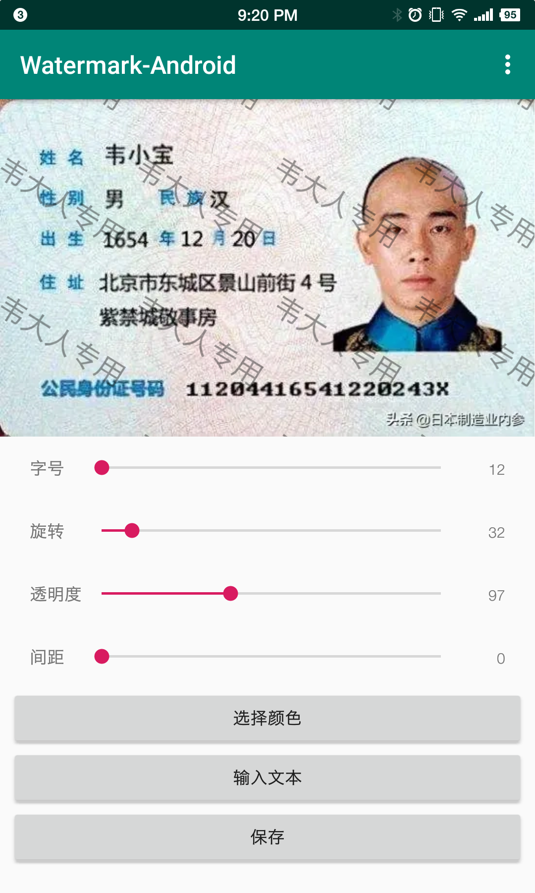
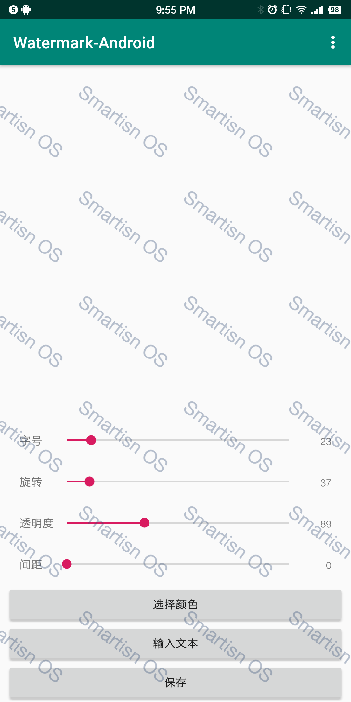
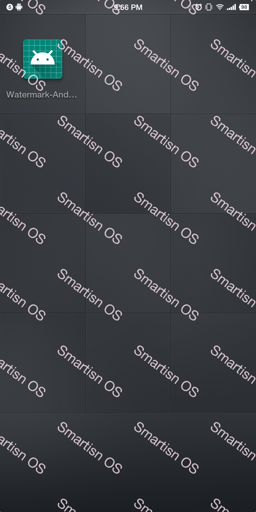

# WatermarkAndroid

一个加水印的小工具

主要功能包括：

1. 图片加水印，并导出图片
2. Android系统全局加水印
3. 调整水印样式：修改水印字号、旋转水印、修改水印颜色、调整水印间距

## 图片加水印

| 水印编辑页面                                                 | 导图图片                                    |
| ------------------------------------------------------------ | ------------------------------------------- |
|  |  |

## 全局水印

全局水印借鉴了[全局水印](https://github.com/yangxiaoge/GlobalWaterMarker)项目，在项目的基础上新增了水印编辑功能。

| 全局水印编辑页面                                             | 效果                                                         |
| ------------------------------------------------------------ | ------------------------------------------------------------ |
|  |  |

